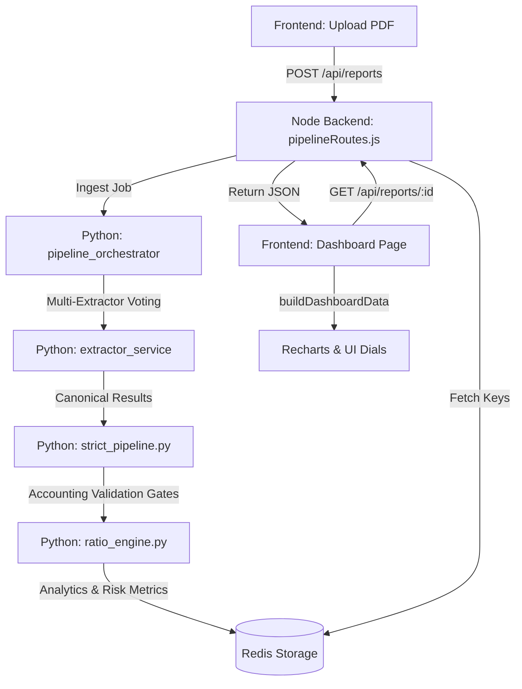

# Dashboard Data Fetching & Mapping Workflow

This document provides a comprehensive, A-to-Z technical guide of how the **Financial Document Intelligence (FDI)** dashboard fetches, validates, calculates, maps, and displays financial report data.

---

## 🗺️ High-Level Architecture Flow



---

## 📥 Stage 1: Ingestion & Extraction (The Intake)

### 1. Ingress File Upload
When a user uploads financial report PDF files, the frontend initiates a request in [api.ts](file:///d:/PLC-Report-Analyzer-BZL/frontend/src/lib/api.ts#L149-L162):
- **Function**: `uploadReports(files, metadata)`
- **Endpoint**: `POST /api/reports`
- **Output**: Returns a unique `report_id` and saves it in `window.localStorage` under the key `fdi.currentReportId`.

### 2. Job Queueing & Python Orchestration
The Node backend in [pipelineRoutes.js](file:///d:/PLC-Report-Analyzer-BZL/nodeBackend/src/routes/pipelineRoutes.js#L1058) receives the upload, sets up the job metadata, and hands execution over to the Python backend worker.
- **Orchestrator Entry point**: [run_full_pipeline](file:///d:/PLC-Report-Analyzer-BZL/pipeline_orchestrator/full_pipeline.py#L699) in `pipeline_orchestrator/full_pipeline.py`.
- **Mode**: Runs in `AUDIT_MODE` (OCR-enabled, 300 DPI page rendering, multi-strategy extractors, and retry pipelines).

---

## 🗳️ Stage 2: The Multi-Extractor Voting System
For every statement page, the extractor service runs **four distinct extraction strategies** (called Extractors A, B, C, and D):
* **Extractor A (Table Parser)**: Structured HTML-style table parser.
* **Extractor B (Regex Parser)**: Scans for exact match financial total markers (e.g. `Total Assets`, `Net Profit`).
* **Extractor C (LLM Structured)**: Generates a JSON schema response from the page layout.
* **Extractor D (Inference Engine)**: Computes missing subtotals if sub-level line items were extracted.

**Reconciliation Engine**: 
* If $\ge 2$ extractors agree on a numeric value, it is accepted.
* If only 1 extractor finds a value, a page re-extraction retry is triggered.
* If they all disagree or fail, the field is marked as missing.

---

## 🛡️ Stage 3: Normalization & Accounting Validation Gates
Once the raw table extractions are combined, the pipeline runs the **Validation & Gating** system. This step is defined in [strict_pipeline.py](file:///d:/PLC-Report-Analyzer-BZL/services/analysis_service/strict_pipeline.py).

### 1. Field Synonym Normalization
Raw labels are mapped to standardized variables using the `_normalize_year` function. The helper function `_gf` (get field) scans specific financial statements with a list of synonym fallbacks:

* **Revenue mapping**:
  ```python
  candidates = [
      _gf(p, "income_statement", "revenue"),
      _gf(p, "income_statement", "total_operating_income"),
      _gf(p, "income_statement", "net_operating_income"),
      _gf(p, "income_statement", "revenue_or_interest_income"),
      _gf(p, "income_statement", "net_interest_income"),
  ]
  ```
* **Balance Sheet mapping**:
  - `total_assets` $\rightarrow$ maps `"total_assets"`
  - `total_liabilities` $\rightarrow$ maps `"total_liabilities"`
  - `equity` $\rightarrow$ maps `["total_equity", "equity", "total_shareholders_equity", "shareholders_equity"]`
  - `cash` $\rightarrow$ maps `["cash_and_cash_equivalents", "cash", "cash_and_equivalents"]` (with fallback to the cash flow statement's `closing_cash`).

### 2. Hard Validation Gates
Before proceeding to analysis, the normalized data is run through strict validation rules:
* **Accounting Equations**: 
  - $\text{Assets} = \text{Liabilities} + \text{Equity}$
  - $\text{Opening Cash} + \text{Net Cash Flow} = \text{Closing Cash}$
* **Coverage Gates**:
  - Income Statement must have $\ge 80\%$ of required fields.
  - Balance Sheet must have $\ge 70\%$ of required fields.
  - Cash Flow must have $\ge 60\%$ of required fields.
* **Outcome**: If coverage is insufficient or critical equations fail, the pipeline aborts, returns `EXTRACTION_INCOMPLETE`, and blocks downstream analysis.

### 3. Confidence Score Calculation
The confidence score is computed mathematically:
$$\text{confidence} = \left(\text{statement\_coverage} \times 0.35 + \text{cross\_extractor\_agreement} \times 0.25 + \text{accounting\_validation} \times 0.25 + \text{numeric\_density} \times 0.15\right) \times 100$$

---

## 🧮 Stage 4: Financial Ratio & Risk Calculation

If the validation gates pass, the pipeline executes the analytical engines.

### 1. Ratio Engine
[compute_ratios](file:///d:/PLC-Report-Analyzer-BZL/services/analysis_service/analytics/ratio_engine.py#L416) calculates structural, leverage, and profitability ratios:
* **Gross Profit Margin**: $\frac{\text{Gross Profit}}{\text{Revenue}}$
* **Net Profit Margin**: $\frac{\text{Net Income}}{\text{Revenue}}$
* **Return on Equity (ROE)**: $\frac{\text{Net Income}}{\text{Average Equity}}$ (or total equity if comparative is absent).
* **Current Ratio**: $\frac{\text{Current Assets}}{\text{Current Liabilities}}$
* **Quick Ratio**: $\frac{\text{Current Assets} - \text{Inventory}}{\text{Current Liabilities}}$

### 2. Risk Scoring Engine
[compute_risk_signals](file:///d:/PLC-Report-Analyzer-BZL/services/analysis_service/analytics/risk_engine.py#L30) weights risks out of 100:
* **Liquidity Risk**: Based on `current_ratio` threshold ($>1.5$ is Low, $1.0 - 1.5$ is Medium, $<1.0$ is High).
* **Leverage Risk**: Based on `debt_ratio` ($\le 40\%$ is Low, $40\% - 60\%$ is Medium, $>60\%$ is High).
* **Profitability Risk**: Based on `return_on_equity` ($\ge 12\%$ is Low, $6\% - 12\%$ is Medium, $<6\%$ is High).
* **Growth Risk**: Based on `revenue_growth_yoy` ($\ge 8\%$ is Low, $0\% - 8\%$ is Medium, $<0\%$ is High).

---

## 💾 Stage 5: Persistence & Node Backend Retrieval

### 1. Redis Key Storage
Once computed, [redis_artifacts.py](file:///d:/PLC-Report-Analyzer-BZL/pipeline_orchestrator/redis_artifacts.py#L36) stores the JSON records into Redis:
* `report:${reportId}:meta` — basic metadata (company name, symbol, sector).
* `report:${reportId}:ratios` — yearly computed ratios.
* `report:${reportId}:patterns` — array of text insights generated by the rules engine.
* `report:${reportId}:risk` — risk score breakdowns.
* `report:${reportId}:confidence` — the mathematical confidence score structure.
* `report:${reportId}:normalized_results` — tabular normalized values.

### 2. Node Backend API Handler
When the dashboard page loads, the frontend calls the GET API:
- **File**: [pipelineRoutes.js](file:///d:/PLC-Report-Analyzer-BZL/nodeBackend/src/routes/pipelineRoutes.js#L1530)
- **Endpoint**: `GET /api/reports/:reportId`
- **Mechanism**: Performs a `Promise.all` fetch from Redis, parses the JSON strings, aggregates them into a single report object, and serves it to the frontend.

---

## 📊 Stage 6: Frontend Mapping & UI Rendering

The frontend dashboard is located in [dashboard.index.tsx](file:///d:/PLC-Report-Analyzer-BZL/frontend/src/routes/dashboard.index.tsx).

### 1. The useEffect Data Hook
On mount, the component retrieves the active report details:
```typescript
useEffect(() => {
  const reportId = getCurrentReportId();
  if (!reportId) return;
  setLoading(true);
  getFullReport(reportId).then((data) => {
    setReport(data);
    const years = Object.keys(data?.analytics?.ratios?.by_year || {}).map(Number).filter(Number.isFinite).sort();
    if (years.length) setYear(years[years.length - 1]);
  }).finally(() => setLoading(false));
}, []);
```

### 2. Frontend Value Mapping (`buildDashboardData`)
The frontend takes the backend response (`report`) and maps it to UI variables inside `buildDashboardData(report, selectedYear)`:

| Dashboard Component | UI Display Variable | Mapped Backend Field |
| :--- | :--- | :--- |
| **Section 1: KPIs** | **Revenue** | `ratios.by_year[selectedYear].revenue` |
| | **Net Profit** | `ratios.by_year[selectedYear].net_income` |
| | **Total Assets** | `ratios.by_year[selectedYear].total_assets` |
| | **Cash Flow** | `ratios.by_year[selectedYear].operating_cash_flow` |
| **Section 2: Trends** | **Revenue (M) Bar Chart** | `yearSeriesData` built from `ratios.by_year[y].revenue` |
| | **Cash Flow (M) Area Chart** | `yearSeriesData` built from `ratios.by_year[y].operating_cash_flow` |
| | **Interest Expense Line Chart** | `yearSeriesData` built from `operating_profit / interest_coverage` |
| | **Liabilities Line Chart** | `yearSeriesData` built from `ratios.by_year[y].total_liabilities` |
| **Section 3: Insights** | **AI Observation** | Map over `report.analytics.patterns` list |
| **Section 4: Risks** | **Liquidity Risk Dial** | `report.analytics.risk` liquidity score & items (Current/Quick/Cash Ratios) |
| | **Leverage Risk Dial** | `report.analytics.risk` leverage score & items (Debt to Equity/Interest Coverage/Debt Ratio) |
| | **Profitability Risk Dial**| `report.analytics.risk` profitability score & items (Net Margin/ROA/ROE) |
| | **Growth Sustainability Dial**| `report.analytics.risk` growth score & items (Revenue Growth/Earnings Growth/Volatility) |

### 3. Scaling & Unit Formatting
To support reports of varying sizes (thousands vs. millions), the frontend dynamically adjusts its display factor:
```typescript
const maxRev = Math.max(...sortedYears.map(y => byYear[y]?.revenue || 0));
const divideFactor = maxRev > 1e6 ? 1e6 : (maxRev > 1e3 ? 1e3 : 1);
const unitStr = maxRev > 1e6 ? "M" : (maxRev > 1e3 ? "K" : "");
```
All chart and KPI metrics are scaled by this factor (e.g. `(val / divideFactor)`) so labels display cleanly in standard units (M or K).
